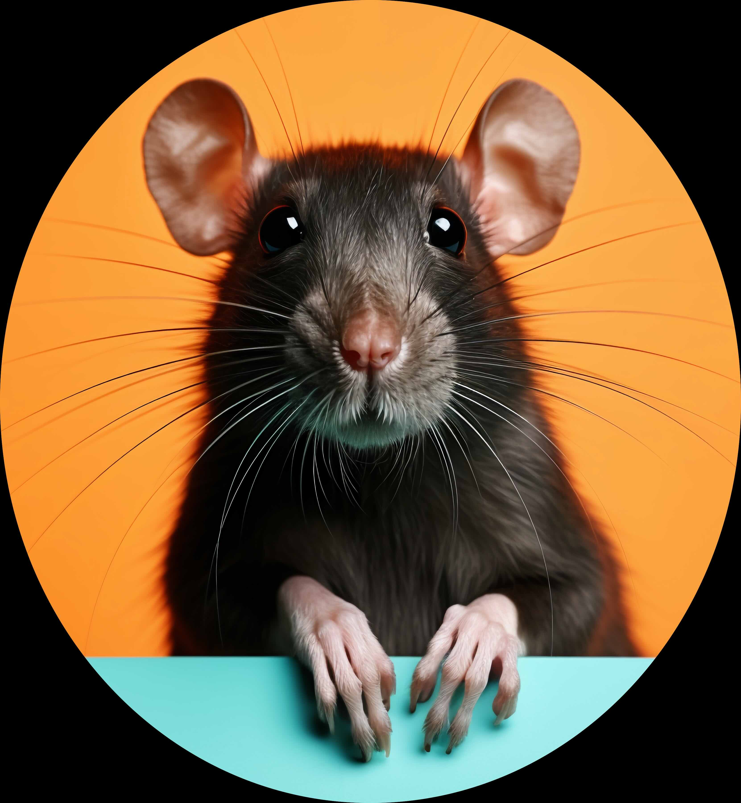
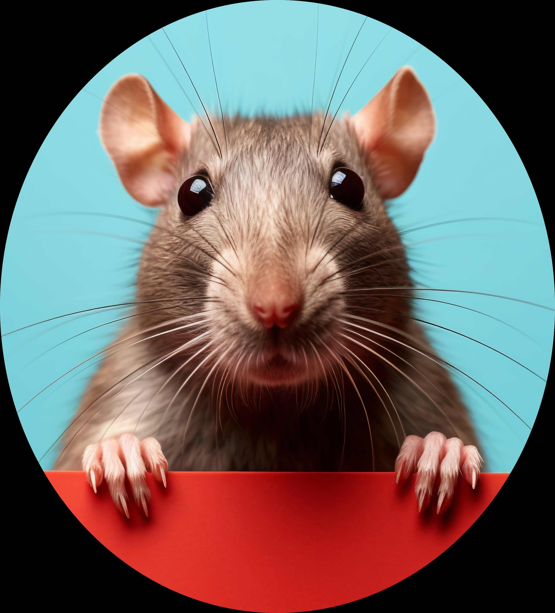
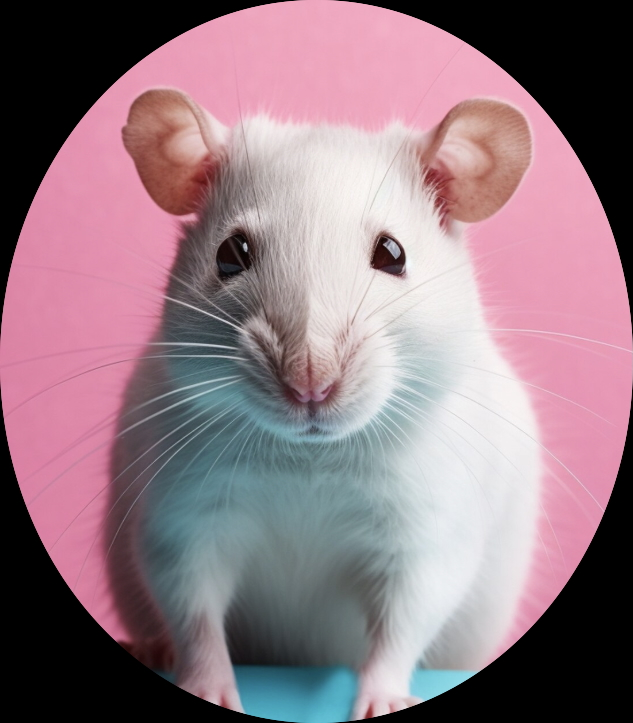
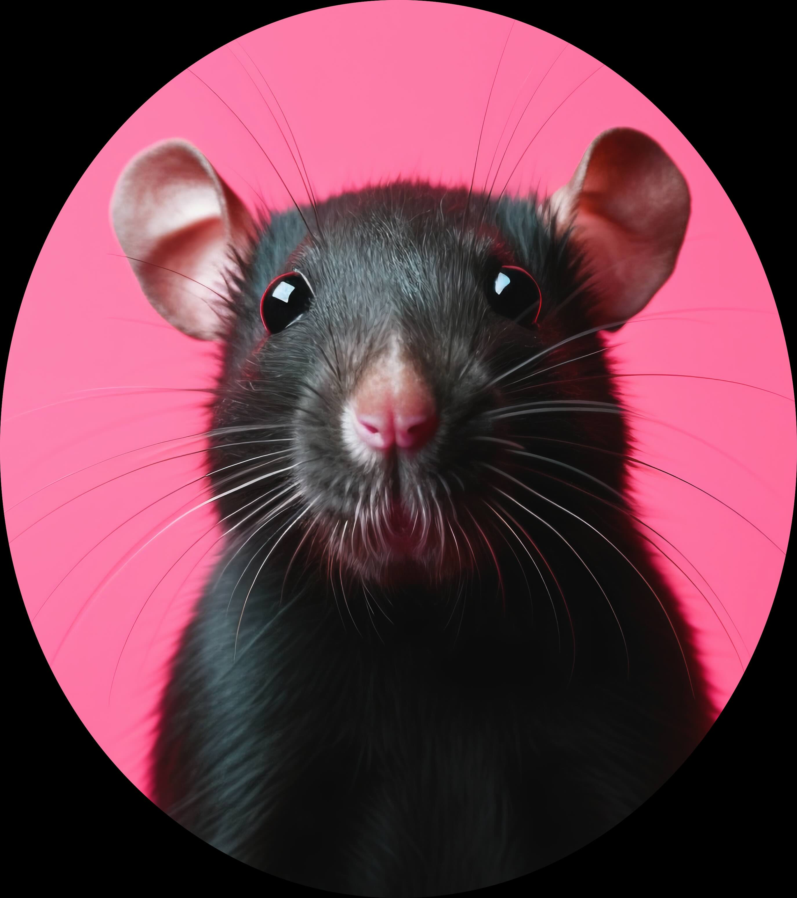

<link href="https://fonts.googleapis.com/css2?family=Kranky&display=swap" rel="stylesheet">

<h1 class="rat-title">Meet Our Team</h1>

  
  
Zihan Xiong (zx2527)

  
  
Wanting Dong (wd2311)

  
  
Hsuanyi Lee (hl3858)

  
  
Yue Hu (yh3823)

  

